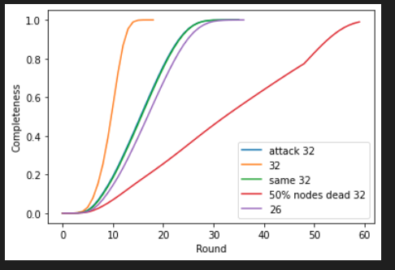

metric

through: average throughput

latency: average rounds that one message takes to reach to 95% nodes

completeness: percentage of messages that reach to all of nodes

95% completeness: percentage of messages that reach to 95% of nodes

setting: 10,000 nodes, 20Mbps, 32 receivers per message
| metric | with attack (20% nodes are dead) | without attack|
|:---:|:---:|:---:|
| throughput |~80%|~97%|
|latency|max: 32 ave: 17 min: 5|max: 14 ave: 10 min: 4|
|completeness|100%|100%|
|95% completeness|100%|100%|

setting: 10,000 nodes, 20Mbps, 16 receivers per message
| metric | with attack (20% nodes are dead) | without attack|
|:---:|:---:|:---:|
| throughput |~78%|~94%|
|latency|max: 47 ave: 24 min: 8|max: 25 ave: 16 min: 6|
|completeness|97.8%|99.88%|
|95% completeness|100%|100%|

