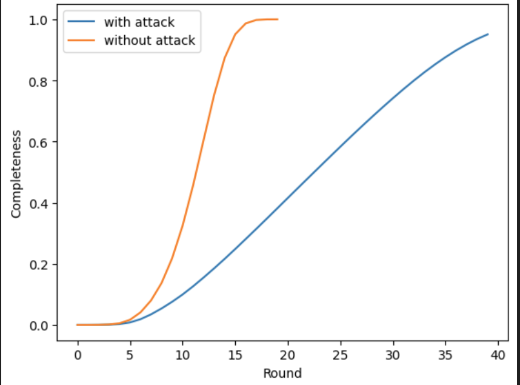

metric
through: average throughput
latency: average rounds that one message takes to reach to 95% nodes
completeness: percentage of messages that reach to all of nodes
95% completeness: percentage of messages that reach to 95% of nodes

setting: 10,000 nodes, 20Mbps, 32 receivers per message
| metric | with attack (20% nodes are dead) | without attack|
|:---:|:---:|:---:|
| throughput |~80%|~98%|
|latency|max: 57 ave: 32 min: 6|max: 20 ave: 13 min: 5|
|completeness|92%|100%|
|95% completeness|92%|100%|

setting: 10,000 nodes, 20Mbps, 16 receivers per message
| metric | with attack (20% nodes are dead) | without attack|
|:---:|:---:|:---:|
| throughput |~78%|~97%|
|latency|max: 66 ave: 38 min: 10|max: 31 ave: 20 min: 7|
|completeness|87.8%|99.924%|
|95% completeness|89.7%|100%|

